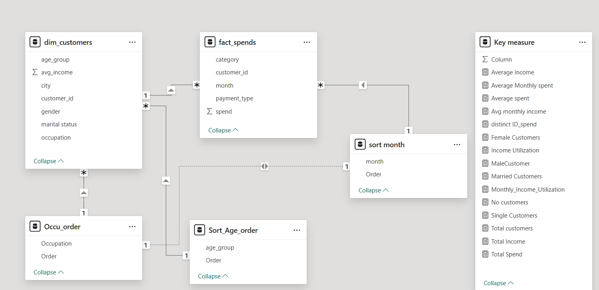

# Credit Card Product Strategy Analysis
## Problem Statement
Mitron Bank is a legacy financial institution headquartered in Hyderabad. They want to introduce a new line of credit cards, aiming to broaden its product offerings and reach in the financial market.Provide insights to the Product Strategy Team in the  Mitron Bank. 
# Purpose of Analysis
- Broaden Mitron Bank’s product offerings and increase its reach in the financial market.
- To understand Customer behaviors and its need.
- To Identify High Value Customer Segments.
- Utilize insights for informed decision-making, guiding the bank's strategy in the new credit card expansion project.
# Data Model

## Key Insights
- Demographic Insights
- Income Analysis
- Expenditure Pattern
- Customer’s Income Utilization
